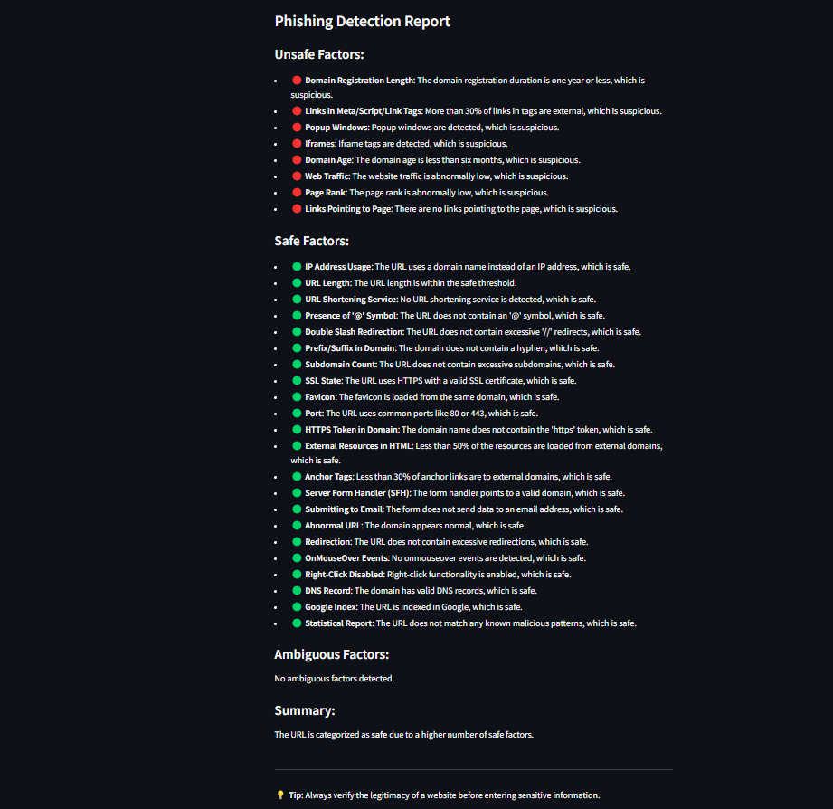

#### 🛡️ Phishing Website Detection System 🚨
This project aims to detect phishing websites using various machine learning techniques. The solution consists of multiple components, including data ingestion, preprocessing, model training, performance evaluation, and deployment using FastAPI, Streamlit, Docker, AWS EC2, and GitHub Actions. The model also integrates with LLM Groq for automatic report generation. The entire pipeline is modular, scalable, and designed for easy maintenance and updates.

.

#### 💡 Key Features
**ETL Pipeline 🧑‍💻:** Automates data extraction, transformation, and loading into MongoDB Atlas.
**Data Validation ✅:** Ensures high-quality data input and checks for data drift.
**Model Training 📊:** Train and test the phishing detection model using preprocessed data.
**FastAPI Integration ⚡:** Create an API for training and testing the model.
**Interactive UI with Streamlit 🎮:** Easy-to-use web interface for predictions.
**DAGsHub 📈:** Track and compare model performance.
**Dockerization 🐳:** Package the solution in containers for deployment on AWS EC2.
**CI/CD with GitHub Actions 🔄:** Automate the build, test, and deployment process.
**Report Generation 📑:** Generate reports using the LLM Groq model
#### columns/Features
  - having_IP_Address
  - URL_Length
  - Shortining_Service
  - having_At_Symbol
  - double_slash_redirecting
  - Prefix_Suffix
  - having_Sub_Domain
  - SSLfinal_State
  - Domain_registeration_length
  - Favicon
  - port
  - HTTPS_token
  - Request_URL
  - URL_of_Anchor
  - Links_in_tags 
  - SFH
  - Submitting_to_email
  - Abnormal_URL
  - Redirect
  - on_mouseover
  - RightClick
  - popUpWidnow
  - Iframe
  - age_of_domain
  - DNSRecord 
  - web_traffic
  - Page_Rank
  - Google_Index
  - Links_pointing_to_page
  - Statistical_report
  - Result

#### 1. Clone the Repository 🚀

#### 2. Install Dependencies 📦

#### FastAPI for Model Training and Testing ⚡
Use FastAPI to interact with the model:

Train the model: /train
Test the model: /test
Access the API at http://localhost:8000 to interact with the model.

#### 🎯 Model Accuracy
Model accuracy measures how well the system detects phishing websites.

- Accuracy: Percentage of correct predictions.(.990)
- Precision: Correct phishing predictions out of all predicted phishing.(0.99)
- Recall: Correct phishing predictions out of actual phishing sites.(0.99)
- F1-Score: Balance between precision and recall. (0.99)
####  Streamlit UI 🎮
Start the Streamlit application for an interactive user interface:

**Copy**

**streamlit run ui/streamlit_app.py**

This will open a dashboard where you can input URLs for phishing detection.

Interactive Features:

Live Predictions 🌐: Enter a website URL to predict whether it’s phishing or not.
- Model Comparison 📊: View metrics for different model versions.
- Model Performance Graphs 📉: Visualize model evaluation results.
##### reuslt ::

####  CI/CD with GitHub Actions 🔄
Automate the testing, building, and deployment of the project using GitHub Actions. This process ensures that any new code pushed to the repository is automatically tested and deployed.

#### AWS EC2 Deployment 🌐
Deploy the system on AWS EC2:

- Create an EC2 instance.
- Set up Docker on EC2.
- Push the Docker container to AWS ECR.
- Pull and run the Docker container on EC2.

#### 🔄 Data Flow Overview
- **Data Ingestion 💾**: Raw data is ingested from external sources and stored in MongoDB Atlas.
- **Data Validation ✅:** We ensure data is clean and perform checks for any data drift.
- **Data Transformation 🔄:** Features are extracted and processed for training.
- **Model Training 🧠:** The model is trained using processed data.
- **Model Evaluation 📊:** The model's performance is evaluated and tracked using DAGsHub.
- **Deployment 🚀:** The solution is containerized using Docker and deployed on AWS EC2.
- **User Interface 🖥️:** Streamlit allows users to interact with the model and view predictions.
- **Report Generation 📝:** Automated reports are generated using LLM Groq.

#### 🔧 Technologies Used
- **Python 🐍:** Programming language.
- **MongoDB Atlas 🌍:** Cloud-based database for data storage.
- **FastAPI ⚡:** For API creation and serving the model.
- **Streamlit 🎨:** Web-based UI for predictions and evaluation.
- **Docker 🐋:** Containerization for consistency across environments.
- **AWS EC2 & ECR ☁️:** Cloud infrastructure for deploying the system.
- **GitHub Actions 🔄:** Continuous integration and deployment.
- **DAGsHub 📈:** For tracking and comparing model performance.
- **LLM Groq 🧠:** For generating detailed reports.
- **Machine Learning 🤖:** For developing the phishing detection model using algorithms like Random Forest, SVM, and Neural Networks.

#### 📜 License
This project is licensed under the MIT License - see the LICENSE file for details.